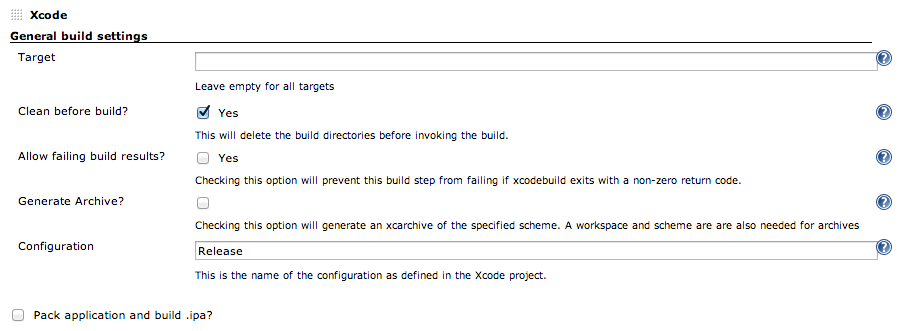
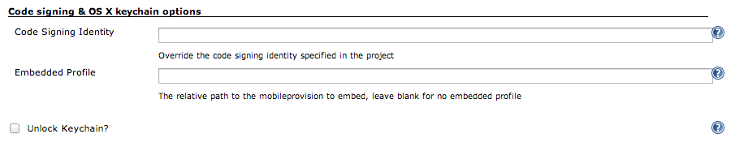
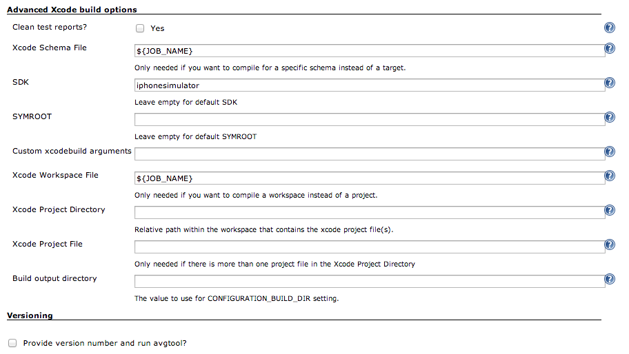

JenkinsSample | Jenkinsおじさんの設定サンプル
=============

## Install pods

- Execute Shell | シェルの実行

```sh
pod install
```

## Build Project

- Xcode Plugin





## Perform XCTest

- Execute Shell | シェルの実行

```sh
xcodebuild test -workspace ${JOB_NAME}.xcworkspace -scheme ${JOB_NAME} -destination 'name=iPhone Retina (4-inch 64-bit),OS=7.1' | ocunit2junit
```
